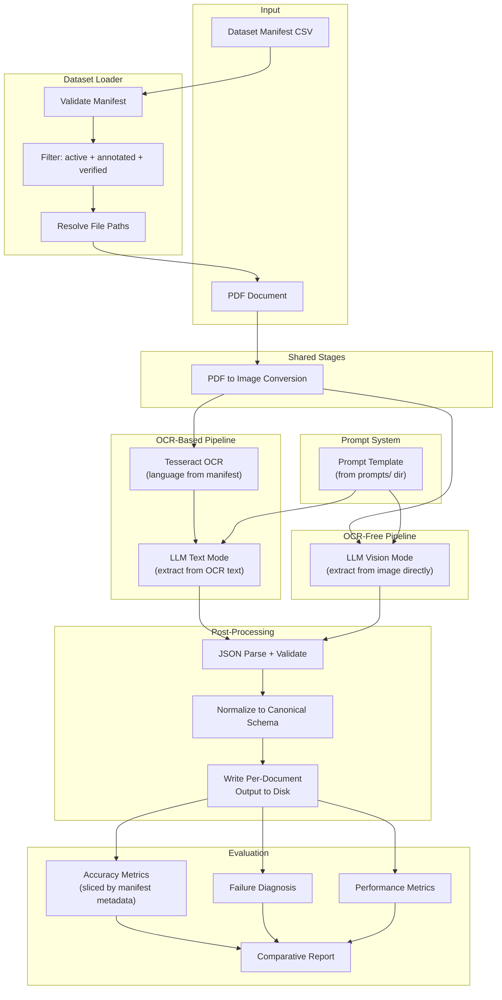

# SPEC — OCR-Based vs OCR-Free Template-Free Extraction (Utility Bills)

## 1. Experimental Design

### Core Comparison (RQ1 + RQ2)

The LLM reasoning layer is held **constant** across both pipelines. The only variable is the input modality:

- **OCR-based**: `PDF -> image -> Tesseract OCR (language from manifest) -> raw text -> LLM (text mode) -> structured JSON -> normalize -> canonical schema`
- **OCR-free**: `PDF -> image -> LLM (vision mode) -> structured JSON -> normalize -> canonical schema`

This isolates the research question: **does explicit OCR preprocessing help or hurt extraction accuracy compared to direct visual extraction by the same model?**

### RQ3: Effect of Model Choice (2x2 Factorial)

Run the paired comparison (text mode vs vision mode) with at least two different LLM backends:

```
             | Text Mode (OCR-based) | Vision Mode (OCR-free) |
-------------|-----------------------|------------------------|
  Model A    |       Run 1           |       Run 2            |
  Model B    |       Run 3           |       Run 4            |
```

Sub-questions:
- Does one model consistently outperform the other regardless of mode?
- Does the OCR-vs-vision accuracy gap widen or narrow depending on the model?
- Cost-efficiency comparison across all four conditions.

### Locked Baseline Decisions (to reduce churn)

These baseline choices are fixed for the first full experimental runs (you can extend later, but keep these constant for the baseline matrix):

- **Model A (OpenAI)**: `gpt-4o`
- **Model B (Anthropic)**: `claude-3-5-sonnet`
- **Dev / cost-control models (optional)**:
  - OpenAI: `gpt-4o-mini`
  - Anthropic: Claude “Haiku” tier (if available in your account)
- **Vision input (baseline)**: **first 2 pages only** per document (page 1–2)
  - Rationale: on most bills, the majority of target fields appear within the first two pages; processing all pages increases cost/latency.

### Framing Note

"OCR-free" here means "VLM direct visual extraction" — not a specialised document understanding model like Donut. The comparison is between **explicit OCR-mediated extraction** vs **implicit visual extraction** using the same reasoning engine.

### Language Asymmetry Note

The OCR-based pipeline depends on knowing the document language (Tesseract needs a per-document language pack). The VLM vision mode handles multilingual input natively. This asymmetry is worth discussing in the write-up.

---

## 2. Resolved Open Questions

| # | Question | Decision |
|---|----------|----------|
| Q1 | Run mode | Single pipeline config per CLI invocation. Comparison is post-hoc via evaluation module. |
| Q2 | Config vs CLI | YAML config as base; CLI flags override for quick iteration. |
| Q3 | Data manifest | Explicit manifest CSV is the single source of truth. Replaces directory scanning. |
| Q4 | LLM choice | Provider-agnostic interface. Start with any two providers. Trivial to add more. |
| Q5 | OCR-free approach | Unified LLM backend. Same model, text mode vs vision mode. |
| Q6 | Zero-shot vs fine-tuning | Eliminated. Both pipelines use the same prompted LLM. |
| Q7 | Performance metrics | Wall-clock, per-stage timing, API latency, token usage, cost. Local CPU/RAM only for Tesseract. |
| Q8 | Database | JSON/CSV flat files. Extensible to SQLite/remote DB later. |
| Q9 | RQ3 | Effect of model choice: 2x2 factorial (model x pipeline mode). |

---

## 3. Architecture



### Design Principles

- **Strategy pattern** for swappable components: OCR engines, LLM providers
- **Abstract base classes** define contracts; concrete implementations registered in a provider registry
- **Manifest-driven**: dataset manifest CSV is the single source of truth for document metadata, filtering, and file resolution
- **Prompt-as-config**: extraction prompts are versioned files selected via config, not hardcoded in provider classes
- **Per-document persistence**: results written to disk immediately after processing, enabling crash recovery and run resumption
- All config via YAML; no hardcoded model names, API keys, or paths

---

## 4. Project Structure

```
project_root/
├── config/
│   ├── default.yaml
│   └── experiments/
├── prompts/
│   └── extraction_v1.txt
├── src/
│   ├── __init__.py
│   ├── schema.py
│   ├── pipeline.py
│   ├── dataset_loader.py
│   ├── ocr/
│   │   ├── __init__.py
│   │   ├── base.py
│   │   └── tesseract.py
│   ├── llm/
│   │   ├── __init__.py
│   │   ├── base.py
│   │   ├── openai_provider.py
│   │   ├── google_provider.py
│   │   └── anthropic_provider.py
│   ├── normalisation.py
│   ├── evaluation/
│   │   ├── __init__.py
│   │   ├── metrics.py
│   │   ├── diagnosis.py
│   │   └── comparator.py
│   ├── performance.py
│   └── utils.py
├── data/
│   ├── dataset_manifest.csv
│   ├── bills/
│   └── ground_truth/
├── results/
│   ├── runs/
│   └── reports/
├── cli.py
├── requirements.txt
├── SPEC.md
├── README.md
└── tests/
    ├── test_schema.py
    ├── test_normalisation.py
    ├── test_dataset_loader.py
    ├── test_evaluation.py
    └── test_pipeline.py
```

---

## 5. Canonical Output Schema (12 fields)

| Field | Type | Notes |
|---|---|---|
| `provider_name` | string \| null | Utility company name |
| `utility_type` | string \| null | `electricity` / `gas` / `water` |
| `bill_number` | string \| null | Invoice/bill reference number |
| `bill_date` | date \| null | YYYY-MM-DD |
| `billing_period_start` | date \| null | YYYY-MM-DD |
| `billing_period_end` | date \| null | YYYY-MM-DD |
| `due_date` | date \| null | YYYY-MM-DD |
| `total_amount_due` | float \| null | Total amount to pay |
| `currency` | string \| null | ISO 4217 (GBP, EUR, etc.) |
| `account_number` | string \| null | Customer account reference |
| `consumption_amount` | float \| null | Usage quantity |
| `consumption_unit` | string \| null | kWh, m3, litres, SMC, etc. |

---

## 6. Dataset Manifest

Single source of truth: `data/dataset_manifest.csv`.

| Column | Type | Purpose |
|---|---|---|
| `document_id` | string | Unique key and filename stem |
| `language` | string | ISO 639-1 (`en`,`de`,`fr`,`it`). Drives OCR language + evaluation slicing |
| `utility_type` | string | `electricity` / `gas` / `water` |
| `provider` | string | Billing company name |
| `digital_native` | boolean | Born-digital vs scanned |
| `page_count` | integer | Number of pages |
| `annotated` | boolean | Ground truth JSON created |
| `verified` | boolean | Ground truth manually verified |
| `status` | string | `active` / `excluded` |

Runnable set: `status=active AND annotated=true AND verified=true`.

File resolution: `data/bills/{document_id}.pdf` and `data/ground_truth/{document_id}.json`.

---

## 7. Per-Document Output Structure

### Run ID format
`{timestamp}_{provider}_{model}_{mode}` (e.g., `20260401_120000_openai_gpt4o_vision`)

### Directory layout
```
results/runs/{run_id}/
├── config.yaml
├── manifest_snapshot.csv
├── prompt.txt
├── summary.json
└── documents/
    └── {document_id}/
        ├── extraction.json
        ├── raw_llm_output.txt
        ├── ocr_text.txt          (ocr_text mode only)
        ├── timings.json
        └── metadata.json
```

### Resume logic
If `extraction.json` exists for a document, skip it. Disable with `--force`.

---

## 8. Key Module Interfaces

### 8.1 BillExtraction (Pydantic model)
All 12 fields optional (nullable). Includes `schema_description()` classmethod for prompt rendering.

### 8.2 PipelineResult (Pydantic model)
`document_id`, `extraction`, `raw_llm_output`, `ocr_text`, `timings`, `token_usage`, `model_id`, `pipeline_mode`.

### 8.3 DocumentEntry (dataclass)
`document_id`, `language`, `utility_type`, `provider`, `digital_native`, `page_count`, `pdf_path`, `ground_truth_path`.

### 8.4 DatasetLoader
`load_and_validate()` — validates manifest, filters runnable docs, resolves + verifies file paths.
`load_all()` — loads all docs regardless of flags (for inspection).

### 8.5 OCREngine (ABC)
`extract_text(image, language)` — per-document language via manifest.

### 8.6 LLMProvider (ABC)
`extract_from_text(ocr_text, prompt)` — text mode.
`extract_from_image(image, prompt)` — vision mode.
`get_model_id()` — identifier string.

Providers format the prompt into provider-specific API requests but do not own prompt content.

---

## 9. Prompt Management

Prompts stored as versioned files in `prompts/`. Selected via `llm.prompt_file` in config. Template placeholders: `{schema_description}`, `{ocr_text}`. Exact prompt archived per run in `results/runs/{run_id}/prompt.txt`.

---

## 10. Config Schema

```yaml
pipeline:
  mode: "ocr_text"                # "ocr_text" or "vision"
ocr:
  engine: "tesseract"
  preprocessing:
    enabled: false
    steps: []
llm:
  provider: "openai"
  model: "gpt-4o"
  temperature: 0.0
  max_tokens: 2000
  structured_output: true
  prompt_file: "prompts/extraction_v1.txt"
data:
  manifest: "data/dataset_manifest.csv"
  bills_dir: "data/bills"
  ground_truth_dir: "data/ground_truth"
output:
  results_dir: "results/runs"
  save_intermediate: true
```

CLI `--manifest` is an optional override (useful for subset experiments).

---

## 11. Ground Truth Format

```json
{
  "document_id": "GB_electricity_ovo_001",
  "annotated_by": "student",
  "annotation_date": "2026-03-30",
  "fields": {
    "provider_name": "OVO Energy Ltd",
    "utility_type": "electricity",
    "bill_number": null,
    ...
  }
}
```

Fields not present on the bill set to `null` explicitly.

---

## 12. Evaluation Methodology

### 12.1 Normalisation (applied identically to predictions and ground truth)
- Dates -> ISO 8601 `YYYY-MM-DD`
- Currency -> uppercase ISO 4217
- Strings -> stripped, lowercased, whitespace-collapsed
- Floats -> rounded to 2 decimal places

### 12.2 Accuracy Metrics
- Numeric/date: exact match (float tolerance +/-0.01)
- Strings: exact match + normalised Levenshtein similarity
- Field-level accuracy: per field across all docs
- Document-level accuracy: all fields correct in a doc
- Slicing by manifest metadata (language, utility type, provider, digital_native)

### 12.3 Null Handling

| Ground Truth | Prediction | Classification | Metric Impact |
|---|---|---|---|
| value | value | Normal | In denominator |
| null | value | Hallucination | Incorrect |
| value | null | Omission | Incorrect |
| null | null | Legitimate null | Excluded from denominator |

### 12.4 Failure Diagnosis
**OCR-based**: search stored `ocr_text.txt` for expected value. Present -> LLM failure. Absent -> OCR failure.
**Vision**: compare `raw_llm_output.txt` against expected. Correct pre-normalisation -> normalisation failure. Wrong -> model inference failure.

### 12.5 Provider-Name Legal Suffix Issue
Bills often include legal suffixes (e.g., `"Acque Veronesi s.c. a r.l."`) while ground truth may use a shorter canonical name. Primary evaluation uses exact match + Levenshtein on normalised strings. A secondary analysis may strip common legal-form suffixes (`ltd`, `srl`, `s.c. a r.l.`, `gmbh`, `s.a.`, etc.) to separate semantic errors from formatting differences.

---

## 13. Performance Measurement (RQ2)

| Metric | OCR-based | Vision | How Measured |
|---|---|---|---|
| Total wall-clock time | Yes | Yes | `time.perf_counter()` |
| PDF-to-image time | Yes | Yes | Timer on conversion step |
| OCR time (Tesseract) | Yes | N/A | Timer on OCR step |
| API latency | Yes | Yes | Timer on API call |
| Normalisation time | Yes | Yes | Timer on normalisation step |
| Token usage (in/out) | Yes | Yes | From API response metadata |
| Estimated cost | Yes | Yes | Tokens x per-token pricing |
| Tesseract CPU/RAM | Yes | N/A | `psutil` sampling |

For API-hosted models, server-side compute is not measurable; RQ2 focuses on wall-clock/latency/tokens/cost.

---

## 14. CLI Interface

```bash
python cli.py run --config config/experiments/gpt4o_text.yaml
python cli.py run --config config/default.yaml --mode vision --provider openai --model gpt-4o
python cli.py run --config config/default.yaml --manifest data/subset_en_only.csv
python cli.py run --config config/default.yaml --force
python cli.py evaluate --run-dir results/runs/20260401_120000_openai_gpt4o_text/
python cli.py compare --runs results/runs/...text/ results/runs/...vision/
python cli.py report --runs-dir results/runs/ --output results/reports/
```

---

## 15. Budget Recommendation

With 20-50 documents and 2x2 factorial:
- Main experiments: ~$5-15
- Dev/debugging: ~$5-10
- Reruns: ~$5-10
- **Total: $20-40**

Suggested pairs: GPT-4o-mini + Gemini 1.5 Flash (~$5), GPT-4o + Gemini 1.5 Pro (~$15), GPT-4o + Claude 3.5 Sonnet (~$20).

---

## 16. Implementation Sessions

### Session 1: Foundation -- COMPLETE

Delivered:
- Project scaffolding: directory structure, `requirements.txt`, `config/default.yaml`
- `src/schema.py`: `BillExtraction` (12-field Pydantic model with `schema_description()` classmethod, `SCHEMA_FIELDS` class variable), `PipelineResult`, `DocumentEntry` dataclass
- `src/dataset_loader.py`: `DatasetLoader` with `load_and_validate()` (column validation, duplicate ID check, value validation for language/utility_type/status, `active+annotated+verified` filtering, path resolution, file existence verification) and `load_all()` (for inspection without filtering)
- `src/utils.py`: `load_config()` with `deep_merge()` for CLI overrides, `pdf_to_images()` via pdf2image/Poppler, `load_prompt_template()`, `read_json()`, `write_json()`, `write_text()`, `copy_file()`, `setup_logging()`
- `src/normalisation.py`: `normalise_date()` (10 date formats), `normalise_string()`, `normalise_currency()`, `normalise_float()`, `normalise_extraction()` with `FIELD_NORMALISERS` mapping
- `src/ocr/base.py`: `OCREngine` ABC with `extract_text(image, language)` interface
- `src/ocr/tesseract.py`: `TesseractOCR` with `LANGUAGE_MAP` (`en->eng`, `de->deu`, `fr->fra`, `it->ita`)
- `prompts/extraction_v1.txt`: initial prompt template with `{schema_description}` and `{ocr_text}` placeholders
- `src/llm/__init__.py`, `src/evaluation/__init__.py`: package stubs
- Tests: `test_schema.py` (7 tests), `test_normalisation.py` (16 tests), `test_dataset_loader.py` (14 tests) -- **51 tests, all passing**
- Sample dataset: 5 PDFs in `data/bills/` (2 EN, 3 IT), manifest populated, 5 verified ground truth JSONs in `data/ground_truth/`
- Smoke-tested: PDF->images, OCR (EN+IT), prompt rendering, DatasetLoader runnable validation

### Session 2: LLM Integration + Prompt System

- LLM provider interface (`src/llm/base.py`) -- providers receive prompt as input, do not construct their own
- First provider implementation (e.g., OpenAI -- `src/llm/openai_provider.py`)
- Second provider implementation (e.g., Google Gemini -- `src/llm/google_provider.py`)
- Provider registry (config string -> provider class mapping)
- Manual end-to-end test: one bill through both text and vision modes with one provider

### Session 3: Pipeline Orchestrator + CLI

- `pipeline.py`: orchestrate stages, per-document disk output, resume logic via `extraction.json` existence check
- `cli.py` with `run` command: `--config` required, optional `--manifest`/`--mode`/`--provider`/`--model` overrides, `--force` flag
- `performance.py`: timing context manager, token/cost tracking
- Run config snapshot + manifest snapshot + prompt copy into run output directory
- End-to-end test: batch run on 5+ bills, verify complete output structure on disk

### Session 4: Evaluation Module

- `evaluation/metrics.py`: field-level accuracy, document-level accuracy, Levenshtein similarity
- `evaluation/diagnosis.py`: OCR failure vs LLM failure attribution from disk artefacts
- `evaluation/comparator.py`: cross-run comparison, aggregate tables, slicing by manifest metadata
- `cli.py` with `evaluate` and `compare` commands

### Session 5: Run Experiments

- Run all 4 experimental conditions (2 models x 2 modes) on full dataset
- Verify outputs, fix pipeline bugs
- Re-run (resume mode) if needed after fixes

### Session 6: Analysis + Visualisation

- `cli.py` with `report` command
- Comparative tables, charts (accuracy heatmaps, timing bar charts, cost comparison, failure type distribution)
- Failure diagnosis reports per document
- Statistical summary (means, std devs, per-language/per-utility-type breakdowns)

### Session 7: Polish + Buffer

- Edge case fixes
- README finalisation
- Code cleanup, remove debug artefacts
- Buffer for overruns from earlier sessions

---

## 17. Risks and Mitigations

| Risk | Impact | Mitigation |
|---|---|---|
| 2-week deadline is tight | May not complete all features | Core pipeline + evaluation first; visualisation is P2 |
| Dataset < 20 bills | Weak statistical claims | Aim for 5+ per language (20 minimum). Report limitations. |
| API account setup delays | Blocks Session 2 | Set up accounts during Session 1 |
| OCR text too noisy for LLM | Skewed results toward vision | Store OCR text for diagnosis; this is a valid finding |
| Prompt sensitivity | Results vary with wording | Identical prompt for both modes; archived per run |
| API rate limits / outages | Delays experiments | Retry with backoff; resume mode skips completed docs |
| "Both use same model" criticism | Reviewer questions validity | Comparing input modalities, not models. Controlled variable is a strength. |
| Ground truth annotation errors | Corrupt evaluation | Self-validate via model disagreements. Manifest tracks `verified` flag. |
| Manifest out of sync with disk | Pipeline fails or silently skips | DatasetLoader validates file existence at load time |
| Multi-language Tesseract variance | Confounding variable | Per-language analysis via manifest slicing |
| Provider-name legal suffixes | Inflated string mismatch rate | Report primary + secondary "canonicalised" metric |

---

## 18. Dependencies

Python (via `requirements.txt`):
```
pydantic>=2.0, pyyaml, pdf2image, Pillow, pytesseract, openai, google-generativeai,
anthropic, python-Levenshtein, psutil, matplotlib, seaborn, click, pytest
```

System:
- Poppler (for pdf2image)
- Tesseract OCR + language packs: eng, deu, fra, ita

---

## 19. Out of Scope (Deferred)

- Image preprocessing pipeline (grayscale, binarise, deskew)
- Fine-tuning of any model
- REST API / web frontend
- Docker containerisation
- Specialised OCR-free models (Donut, Florence-2)
- Remote database integration
- Annotation tooling
