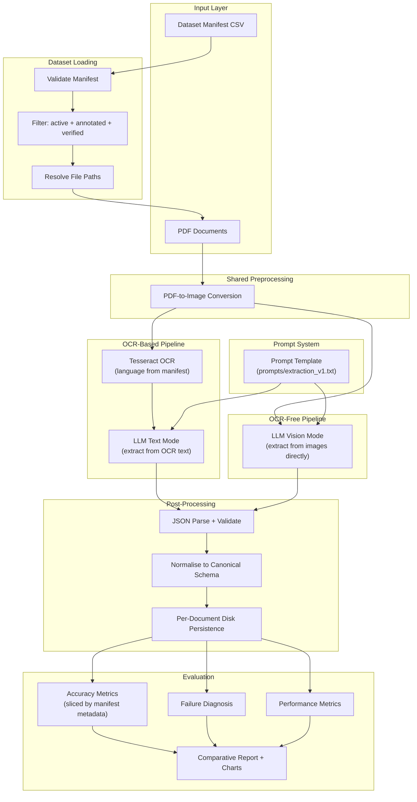

# SPEC — OCR-Based vs OCR-Free Template-Free Extraction from Utility Bills

## 1. Problem Statement and Research Questions

### 1.1 Problem

Automated extraction of structured data from semi-structured documents is a core challenge in document intelligence. Utility bills (electricity, gas, water) are representative of this challenge: they exhibit high variability in layout, language, formatting, and information density across providers and countries. Two paradigms exist for LLM-based extraction:

- **OCR-based (text-mediated)**: PDF pages are rasterised, processed by an OCR engine to produce raw text, and that text is sent to an LLM in text mode for structured extraction.
- **OCR-free (vision-mediated)**: The same rasterised page images are sent directly to a vision-language model (VLM) in vision mode, bypassing OCR entirely.

The relative effectiveness of these paradigms is poorly understood, particularly in template-free, multilingual settings. Existing comparisons typically use different models or different prompts across pipelines, confounding input modality with model architecture and prompt design.

### 1.2 Research Questions

| # | Question |
|---|----------|
| **RQ1** | Does explicit OCR preprocessing improve or degrade extraction accuracy compared to direct visual extraction by the same LLM? |
| **RQ2** | How do the two pipelines compare in cost, latency, and operational complexity? |
| **RQ3** | Does the accuracy gap between OCR-based and OCR-free extraction vary across different LLM backends (model choice effect)? |

### 1.3 Framing Note

"OCR-free" in this project means direct visual extraction using a general-purpose VLM in vision mode — not a specialised document understanding model (e.g. Donut, Florence-2). The comparison is between **explicit OCR-mediated extraction** and **implicit visual extraction** using the same reasoning engine.

---

## 2. Experimental Design

### 2.1 Core Comparison (RQ1 + RQ2)

The LLM reasoning layer is held **constant** across both pipelines. The only variable is the input modality:

- **OCR-based**: `PDF → image → Tesseract OCR (language from manifest) → raw text → LLM (text mode) → structured JSON → normalise → canonical schema`
- **OCR-free**: `PDF → image → LLM (vision mode) → structured JSON → normalise → canonical schema`

This isolates the research question: does explicit OCR preprocessing help or hurt extraction accuracy compared to direct visual extraction by the same model?

### 2.2 2×2 Factorial Design (RQ3)

The paired comparison (text mode vs vision mode) is run with two different LLM backends:

|              | OCR-Text Mode | Vision Mode |
|--------------|---------------|-------------|
| **Model A**  | Condition 1   | Condition 2 |
| **Model B**  | Condition 3   | Condition 4 |

Sub-questions addressed by the factorial design:
- Does one model consistently outperform the other regardless of mode?
- Does the OCR-vs-vision accuracy gap widen or narrow depending on the model?
- Cost-efficiency comparison across all four conditions.

### 2.3 Baseline Decisions

| Parameter | Decision | Rationale |
|-----------|----------|-----------|
| Model A | OpenAI GPT-4o (`gpt-4o`) | State-of-the-art general-purpose model with native vision and Structured Outputs support |
| Model B | Anthropic Claude Sonnet (`claude-sonnet-4-5-20250929`) | Leading alternative architecture from a different provider |
| Vision input | First 2 pages per document | Most target fields appear in the first two pages; limits cost and latency |
| Temperature | 0.0 | Maximises reproducibility |
| Prompt | Zero-shot, single version (`extraction_v1.txt`) | Avoids prompt variation as a confound |
| OCR engine | Tesseract v4+ (LSTM) | Open-source, runs locally (no API cost confound), multilingual support |

### 2.4 Language Asymmetry

The OCR-based pipeline requires per-document language configuration (Tesseract requires a language pack). The VLM vision mode handles multilingual input natively without any configuration. This asymmetry is a design consideration relevant to RQ2 (operational complexity).

---

## 3. System Architecture

### 3.1 Architecture Diagram


```mermaid
flowchart TD
    subgraph input [Input Layer]
        Manifest[Dataset Manifest CSV]
        PDF[PDF Documents]
    end

    subgraph loader [Dataset Loading]
        Validate[Validate Manifest]
        Filter["Filter: active + annotated + verified"]
        Resolve[Resolve File Paths]
    end

    subgraph shared [Shared Preprocessing]
        Convert[PDF-to-Image Conversion]
    end

    subgraph ocrBased [OCR-Based Pipeline]
        OCR["Tesseract OCR\n(language from manifest)"]
        TextLLM["LLM Text Mode\n(extract from OCR text)"]
    end

    subgraph ocrFree [OCR-Free Pipeline]
        VisionLLM["LLM Vision Mode\n(extract from images directly)"]
    end

    subgraph prompt [Prompt System]
        PromptFile["Prompt Template\n(prompts/extraction_v1.txt)"]
    end

    subgraph postProcess [Post-Processing]
        Parse[JSON Parse + Validate]
        Normalize[Normalise to Canonical Schema]
        Persist[Per-Document Disk Persistence]
    end

    subgraph evalBlock [Evaluation]
        Metrics["Accuracy Metrics\n(sliced by manifest metadata)"]
        Diagnosis[Failure Diagnosis]
        Perf[Performance Metrics]
        Report[Comparative Report + Charts]
    end

    Manifest --> Validate --> Filter --> Resolve
    Resolve --> PDF --> Convert
    Convert --> OCR --> TextLLM --> Parse
    Convert --> VisionLLM --> Parse
    PromptFile --> TextLLM
    PromptFile --> VisionLLM
    Parse --> Normalize --> Persist --> Metrics
    Persist --> Diagnosis
    Persist --> Perf
    Metrics --> Report
    Diagnosis --> Report
    Perf --> Report
```

### 3.2 Design Principles

| Principle | Implementation |
|-----------|----------------|
| **Strategy pattern** | `LLMProvider` ABC + registry; `OCREngine` ABC — implementations are swappable |
| **Manifest-driven processing** | `data/dataset_manifest.csv` is the single source of truth for document metadata, filtering, and file resolution |
| **Prompt-as-config** | Prompts are versioned files in `prompts/`, selected via config, never hardcoded |
| **Per-document persistence** | Results written to disk immediately after processing, enabling crash recovery and run resumption |
| **Schema-as-contract** | `BillExtraction` Pydantic model is shared by the prompt, LLM output, ground truth, normalisation, evaluation, and reporting modules |
| **Config-driven execution** | All settings via YAML; no hardcoded model names, API keys, or paths |
| **Disk-mediated decoupling** | Evaluation reads artefacts from disk, not from in-memory objects; pipeline and evaluation are independently runnable |
| **Registry with lazy import** | Provider classes are imported only when needed, avoiding unused SDK loads |

---

## 4. Project Structure

```
project_root/
├── config/
│   └── default.yaml              Default pipeline configuration
├── prompts/
│   └── extraction_v1.txt         LLM prompt template with {schema_description} placeholder
├── src/
│   ├── schema.py                 BillExtraction, PipelineResult, DocumentEntry
│   ├── pipeline.py               Batch orchestrator: run_pipeline(), _process_document()
│   ├── dataset_loader.py         DatasetLoader: validate, filter, resolve manifest
│   ├── normalisation.py          Shared normalisers applied to predictions and ground truth
│   ├── performance.py            Timer context manager, estimate_cost()
│   ├── reporting.py              Chart generation and text summary
│   ├── utils.py                  Config loading, PDF conversion, file I/O
│   ├── env.py                    .env file loading (python-dotenv)
│   ├── ocr/
│   │   ├── base.py               OCREngine ABC
│   │   └── tesseract.py          TesseractOCR adapter
│   ├── llm/
│   │   ├── __init__.py           Public exports: LLMProvider, get_provider
│   │   ├── base.py               LLMProvider ABC
│   │   ├── openai_provider.py    OpenAI Responses API + Structured Outputs
│   │   ├── anthropic_provider.py Anthropic Messages API + JSON fence stripping
│   │   └── registry.py           Provider registry with lazy import
│   └── evaluation/
│       ├── __init__.py           Public exports
│       ├── metrics.py            compare_field, evaluate_document, evaluate_run
│       ├── diagnosis.py          Failure attribution: OCR failure vs LLM failure vs vision failure
│       └── comparator.py         Cross-run comparison: accuracy/performance matrices
├── data/
│   ├── dataset_manifest.csv      Document registry (single source of truth)
│   ├── bills/                    PDF files ({document_id}.pdf)
│   └── ground_truth/             Annotation files ({document_id}.json)
├── results/
│   ├── runs/                     Per-run output directories
│   └── reports/                  Comparative analysis outputs
├── tests/
│   ├── test_schema.py            Schema model tests (35 tests)
│   ├── test_normalisation.py     Normalisation tests (82 tests)
│   ├── test_dataset_loader.py    Manifest validation tests (38 tests)
│   ├── test_evaluation.py        Metrics + diagnosis + comparator tests (82 tests)
│   ├── test_pipeline.py          Pipeline orchestration tests
│   ├── test_llm.py               LLM provider + registry tests
│   ├── test_cli.py               CLI command tests
│   ├── test_ocr.py               OCR engine tests
│   ├── test_utils.py             Utility function tests
│   ├── test_reporting.py         Report generation tests
│   ├── test_performance.py       Timer and cost estimation tests
│   └── test_env.py               Environment loading tests
├── cli.py                        Click-based CLI entry point
├── SPEC.md                       This file
└── README.md                     Setup and usage guide
```

---

## 5. Canonical Output Schema

### 5.1 BillExtraction (12 Fields)

All fields are `Optional` (nullable). Bills may legitimately omit fields; the LLM is instructed to return `null` for absent fields.

| Field | Type | Notes |
|-------|------|-------|
| `provider_name` | `string \| null` | Utility company name; legal suffixes stripped during normalisation |
| `utility_type` | `string \| null` | `electricity` / `gas` / `water` |
| `bill_number` | `string \| null` | Invoice or bill reference number |
| `bill_date` | `date \| null` | Issue date, `YYYY-MM-DD` |
| `billing_period_start` | `date \| null` | Billing period start, `YYYY-MM-DD` |
| `billing_period_end` | `date \| null` | Billing period end, `YYYY-MM-DD` |
| `due_date` | `date \| null` | Payment deadline, `YYYY-MM-DD` |
| `total_amount_due` | `float \| null` | Total amount to pay |
| `currency` | `string \| null` | ISO 4217 code (e.g. `GBP`, `EUR`, `USD`) |
| `account_number` | `string \| null` | Customer account reference |
| `consumption_amount` | `float \| null` | Energy or volume usage quantity |
| `consumption_unit` | `string \| null` | `kWh`, `m3`, `SMC`, `L`, etc. |

### 5.2 Schema Implementation (`src/schema.py`)

`BillExtraction` is a Pydantic `BaseModel`. Key details:

- `SCHEMA_FIELDS` class variable: ordered list of the 12 field names, used by evaluation, normalisation, and reporting to iterate fields consistently across the entire system.
- `schema_description()` classmethod: generates human-readable field descriptions injected into the prompt via the `{schema_description}` placeholder.
- `model_config` with `json_schema_extra`: sets the title to `"Utility Bill Extraction"` for OpenAI Structured Outputs schema compatibility.

### 5.3 PipelineResult

Container returned by the pipeline for each processed document:

| Field | Type | Purpose |
|-------|------|---------|
| `document_id` | `str` | Document identifier from manifest |
| `extraction` | `BillExtraction` | The 12-field extraction result |
| `raw_llm_output` | `str` | Verbatim LLM response (for debugging and diagnosis) |
| `ocr_text` | `str \| None` | Tesseract output; `None` in vision mode |
| `timings` | `dict` | Per-stage timing breakdown in milliseconds |
| `token_usage` | `dict` | Input and output token counts from API response |
| `model_id` | `str` | e.g. `"openai/gpt-4o"` or `"anthropic/claude-sonnet-4-5-20250929"` |
| `pipeline_mode` | `str` | `"ocr_text"` or `"vision"` |

### 5.4 DocumentEntry

Resolved row from `dataset_manifest.csv`, represented as a Python `dataclass`:

| Field | Type | Purpose |
|-------|------|---------|
| `document_id` | `str` | Unique key and filename stem |
| `language` | `str` | ISO 639-1 (`en`, `de`, `fr`, `it`); drives OCR language and evaluation slicing |
| `utility_type` | `str` | `electricity` / `gas` / `water` |
| `provider` | `str` | Billing company name |
| `digital_native` | `bool` | Born-digital vs scanned |
| `page_count` | `int` | Number of pages in the PDF |
| `pdf_path` | `Path` | Resolved absolute path to the PDF file |
| `ground_truth_path` | `Path` | Resolved absolute path to the ground truth JSON |

---

## 6. Dataset Manifest

### 6.1 Structure

Single source of truth: `data/dataset_manifest.csv`.

| Column | Type | Purpose |
|--------|------|---------|
| `document_id` | string | Unique key; doubles as the filename stem for both the PDF and the ground truth JSON |
| `language` | string | ISO 639-1 (`en`, `de`, `fr`, `it`); drives Tesseract language pack and evaluation slicing |
| `utility_type` | string | `electricity` / `gas` / `water` |
| `provider` | string | Billing company name |
| `digital_native` | boolean | Born-digital vs scanned document |
| `page_count` | integer | Number of pages |
| `annotated` | boolean | Ground truth JSON has been created |
| `verified` | boolean | Ground truth has been manually verified |
| `status` | string | `active` / `excluded` |

### 6.2 Runnable Set

A document is included in experimental runs if and only if:

```
status = active  AND  annotated = true  AND  verified = true
```

This three-flag gate, enforced by `DatasetLoader.load_and_validate()`, ensures only quality-controlled documents enter experiments.

### 6.3 File Resolution

- PDF path: `data/bills/{document_id}.pdf`
- Ground truth path: `data/ground_truth/{document_id}.json`

`DatasetLoader` verifies file existence for all runnable documents at load time, failing early with descriptive error messages listing all missing files.

### 6.4 Validation Pipeline

`DatasetLoader.load_and_validate()` runs six sequential validation steps:

1. **File existence** — manifest CSV must exist
2. **CSV parsing** — file must contain at least one data row
3. **Column validation** — all 9 required columns must be present
4. **Duplicate ID detection** — reports exact row numbers of any duplicate `document_id` values
5. **Value validation** — `language`, `utility_type`, and `status` checked against allowed sets; `page_count` must be integer; errors are aggregated and reported together
6. **File existence verification** — both PDF and ground truth must exist for every runnable document

---

## 7. Ground Truth Format

```json
{
  "document_id": "gb_electricity_ovo_001",
  "annotated_by": "student",
  "annotation_date": "2026-03-30",
  "fields": {
    "provider_name": "OVO Energy",
    "utility_type": "electricity",
    "bill_number": null,
    "bill_date": "2026-03-10",
    "billing_period_start": "2025-12-18",
    "billing_period_end": "2026-01-17",
    "due_date": null,
    "total_amount_due": 177.53,
    "currency": "GBP",
    "account_number": "26447122",
    "consumption_amount": 572.502,
    "consumption_unit": "kWh"
  }
}
```

Annotation rules:
- Fields not present on the bill are set to `null` explicitly (distinguishing "absent" from "unannotated").
- `provider_name` uses the canonical name without legal-form suffixes.
- Dates use ISO 8601 (`YYYY-MM-DD`).
- `currency` uses ISO 4217 codes.
- `consumption_unit` uses canonical abbreviations (`kWh`, `m3`, `SMC`, `L`, etc.).

---

## 8. Module Interfaces

### 8.1 LLM Provider (`src/llm/base.py`)

```python
class LLMProvider(ABC):
    def __init__(self, model, temperature=0.0, max_tokens=2000,
                 timeout=120.0, max_retries=2, **kwargs): ...

    @abstractmethod
    def extract_from_text(self, ocr_text: str, prompt: str) -> dict: ...

    @abstractmethod
    def extract_from_image(self, images: list[Image.Image], prompt: str) -> dict: ...

    @abstractmethod
    def get_model_id(self) -> str: ...

    @staticmethod
    def encode_image_base64(image: Image.Image, fmt: str = "PNG") -> str: ...
```

Both extraction methods return:
```python
{
    "raw_output": str,
    "token_usage": {"input_tokens": int, "output_tokens": int},
    "latency_ms": float
}
```

The `prompt` argument contains only extraction instructions and the schema description. Raw data (OCR text or images) is passed as a separate argument and sent in the user message, keeping the instruction context clean and avoiding token duplication.

### 8.2 Provider-Specific API Details

**OpenAI (`src/llm/openai_provider.py`)**: Uses the Responses API (`client.responses.parse`) with Structured Outputs (`text_format=BillExtraction`). Instructions go in the top-level `instructions` parameter; data goes in the `input` list. Vision images use `type: "input_image"` blocks with a configurable `detail` parameter (`"high"` by default). Structured Outputs guarantee schema-valid JSON via constrained decoding — no fence stripping needed.

**Anthropic (`src/llm/anthropic_provider.py`)**: Uses the Messages API (`client.messages.create`) with prompt-instructed JSON output (Anthropic does not support constrained decoding). Instructions go in the `system` parameter; data goes in the `messages` list. Claude may wrap its JSON response in markdown code fences; `_strip_json_fencing()` removes these before downstream parsing. Vision images are base64-encoded and sent as content blocks; `_encode_image_under_limit()` handles the 5 MB per-image limit via PNG/JPEG quality and downscaling.

### 8.3 Provider Registry (`src/llm/registry.py`)

```python
_PROVIDERS = {
    "openai":    "src.llm.openai_provider.OpenAIProvider",
    "anthropic": "src.llm.anthropic_provider.AnthropicProvider",
}
```

`get_provider(config)` reads `config["llm"]["provider"]`, lazily imports the class, and instantiates with `model`, `temperature`, `max_tokens`, `vision_detail`, `timeout`, and `max_retries`. Adding a new provider requires only a new module and one entry in `_PROVIDERS`.

### 8.4 OCR Engine (`src/ocr/base.py`)

```python
class OCREngine(ABC):
    @abstractmethod
    def extract_text(self, image: Image.Image, language: str = "eng") -> str: ...
```

`TesseractOCR` (`src/ocr/tesseract.py`) implements this with a `LANGUAGE_MAP` that maps ISO 639-1 codes (`en`, `de`, `fr`, `it`) to Tesseract codes (`eng`, `deu`, `fra`, `ita`). `TesseractNotFoundError` raises `RuntimeError`; `TesseractError` returns an empty string with a logged warning.

### 8.5 DatasetLoader (`src/dataset_loader.py`)

```python
class DatasetLoader:
    def __init__(self, manifest_path, bills_dir, ground_truth_dir): ...
    def load_and_validate(self) -> list[DocumentEntry]: ...  # Filtered runnable set + file verification
    def load_all(self) -> list[DocumentEntry]: ...           # All rows, no file checks
```

`load_and_validate()` runs the full six-step validation and returns only runnable documents. `load_all()` returns all manifest rows (useful for manifest inspection) with column and duplicate validation but without file existence checks.

---

## 9. Normalisation (`src/normalisation.py`)

### 9.1 Rules

Both predictions and ground truth are normalised identically before comparison, ensuring that formatting differences do not count as extraction errors.

| Field / Type | Normalisation Applied |
|---|---|
| **Dates** (`bill_date`, `billing_period_start`, `billing_period_end`, `due_date`) | Parsed against 10 format patterns (`YYYY-MM-DD`, `DD/MM/YYYY`, `DD.MM.YYYY`, `DD-MM-YYYY`, `B d, Y`, etc.) into ISO 8601. Unparseable strings are passed through unchanged |
| **Strings** (general) | NFC Unicode normalisation, strip whitespace, lowercase, collapse internal whitespace |
| **Provider name** | String normalisation + iterative legal suffix stripping (e.g. `Ltd`, `Limited`, `GmbH`, `SRL`, `S.p.A.`, `s.c. a r.l.`) supporting multi-token suffixes |
| **Utility type** | Multilingual synonym mapping: `luce`/`strom`/`electricite` → `electricity`; `acqua`/`wasser`/`eau` → `water`; `gaz`/`erdgas`/`metano` → `gas` |
| **Currency** | Symbol and name map to ISO 4217 (`€` → `EUR`, `£` → `GBP`); valid 3-letter codes accepted; unknown → `None` with warning |
| **Consumption unit** | Synonym mapping: `kwh`/`kw/h`/`kilowatt hour` → `kWh`; `m³`/`mc`/`cubic metre` → `m3`; `smc`/`sm3` → `SMC`; etc. |
| **Floats** (`total_amount_due`, `consumption_amount`) | EU/US decimal parsing using separator position heuristics; `bool` → `None`; rounded to 2 decimal places |

### 9.2 Float Parsing Heuristic

`_parse_numeric_string()` applies:
- Both dot and comma present: dot before comma → EU format (`1.234,56`); comma before dot → US format (`1,234.56`)
- Comma only → EU decimal separator (`1234,56`)
- No grouping separators → standard `float()` parsing

### 9.3 Dispatch Table

`FIELD_NORMALISERS` maps each of the 12 schema fields to its normaliser function. `normalise_extraction(fields)` applies the appropriate normaliser to every field and returns a dict with exactly 12 keys.

---

## 10. Pipeline Orchestration (`src/pipeline.py`)

### 10.1 Run Execution Flow

`run_pipeline(config, force=False)` executes in order:

1. **Resolve paths** from config (manifest, bills dir, ground truth dir, results dir, prompt file)
2. **Load and validate dataset** via `DatasetLoader.load_and_validate()`
3. **Instantiate LLM provider** via `get_provider(config)` (lazy SDK import)
4. **Instantiate OCR engine** (`TesseractOCR` if `mode == "ocr_text"`, otherwise `None`)
5. **Create run directory** with unique ID: `{timestamp}_{provider}_{sanitised_model}_{mode}`
6. **Snapshot inputs** for reproducibility: copies config YAML, manifest CSV, and prompt template into the run directory
7. **Process each document** with resume logic and error isolation
8. **Write run summary** (`summary.json`) with total, processed, skipped, and failed counts

### 10.2 Per-Document Processing

`_process_document()` executes four timed stages:

| Stage | Description | Timing Key |
|-------|-------------|------------|
| 1 | PDF-to-image conversion (all pages) | `pdf_to_images_ms` |
| 2 | Prompt rendering (`{schema_description}` placeholder substituted) | (negligible) |
| 3a | **OCR path**: Tesseract on first 2 pages → concatenated text → LLM text mode | `ocr_ms`, `llm_call_ms` |
| 3b | **Vision path**: first 2 page images → LLM vision mode | `llm_call_ms` |
| 4 | JSON parsing → normalisation → Pydantic validation | `parse_normalise_ms` |

### 10.3 JSON Parsing Hardening

`_parse_llm_json(raw)` applies four fallback strategies in order:

1. **Direct parse**: `json.loads()` on the stripped response
2. **Markdown fence strip**: regex-matches ` ```json … ``` ` blocks and parses the inner content
3. **Brace extraction**: finds the first `{` and its matching `}` via brace-depth counting and parses the extracted substring
4. **Failure**: raises `ValueError` with a diagnostic excerpt (first 500 characters of the raw response)

### 10.4 Resume Logic

If `extraction.json` already exists in a document's output directory, the document is skipped. The `--force` flag on the `run` command overrides this and re-processes all documents.

### 10.5 Error Isolation

Each document is wrapped in `try/except`. On failure, an `error.json` containing the error message and full traceback is written to the document's output directory. The run continues with the remaining documents. The evaluation module skips documents that have `error.json`.

---

## 11. Per-Run Output Structure

### 11.1 Run ID Format

```
{timestamp}_{provider}_{sanitised_model}_{mode}
```

Example: `20260429_204310_anthropic_claudesonnet4520250929_vision`

The run directory name is determined at execution time and will vary between runs.

### 11.2 Directory Layout

```
results/runs/{run_id}/
├── config.yaml                    Frozen configuration (includes CLI overrides)
├── manifest_snapshot.csv          Manifest at the time of the run
├── prompt.txt                     Exact prompt template used
├── summary.json                   Run statistics (total, processed, skipped, failed)
├── evaluation.json                Written by the evaluate command
└── documents/
    └── {document_id}/
        ├── extraction.json        Normalised 12-field BillExtraction output
        ├── raw_llm_output.txt     Verbatim LLM response
        ├── ocr_text.txt           Tesseract output (OCR-text mode only)
        ├── timings.json           Per-stage timing breakdown (milliseconds)
        ├── metadata.json          Document metadata, provider, model, token usage, cost estimate
        ├── error.json             Error details and traceback (only if document failed)
        └── diagnosis.json         Failure attribution (written by evaluate --diagnose)
```

---

## 12. Evaluation Methodology (`src/evaluation/`)

### 12.1 Normalisation Before Comparison

Both predictions and ground truth are normalised identically via `normalise_extraction()` before field-level comparison. This ensures that correct-but-differently-formatted extractions are not penalised (e.g. `"€"` vs `"EUR"`, `"01/03/2024"` vs `"2024-03-01"`).

### 12.2 Field-Level Comparison

Each field is compared using type-appropriate logic:

| Field Type | Comparison Strategy |
|---|---|
| **Float fields** (`total_amount_due`, `consumption_amount`) | Absolute tolerance ±0.01 — absorbs rounding after 2dp normalisation |
| **Date fields** (`bill_date`, `billing_period_start`, `billing_period_end`, `due_date`) | Exact string match on normalised ISO 8601 strings |
| **String fields** (all others) | Exact match for the `match` flag; Levenshtein similarity ratio (0.0–1.0) for partial credit |

### 12.3 Null Handling — 4-Class Taxonomy

| Ground Truth | Prediction | Classification | Metric Impact |
|---|---|---|---|
| value | value | Normal comparison | Included in denominator |
| `null` | value | **Hallucination** | Incorrect; included in denominator |
| value | `null` | **Omission** | Incorrect; included in denominator |
| `null` | `null` | **Both null** | Excluded from denominator |

`both_null` represents fields legitimately absent from both the bill and the extraction. These are counted as matching (`match=True`, `similarity=1.0`) but excluded from accuracy denominators to prevent inflation.

### 12.4 Accuracy Metrics

| Metric | Definition |
|--------|------------|
| **Field-level accuracy** | Per field: `correct / (correct + incorrect + hallucination + omission)` across all documents |
| **Document-level accuracy** | Fraction of documents with zero incorrect, zero hallucination, and zero omission fields |
| **Overall accuracy** | All fields across all documents: total correct / total evaluated |
| **Slice accuracy** | Accuracy computed for subsets of documents grouped by `language` or `utility_type` |

### 12.5 Failure Diagnosis (`src/evaluation/diagnosis.py`)

For each incorrect field:

**OCR-text mode**: search the stored `ocr_text.txt` for the ground truth value (case-insensitive substring match).
- Value found → **LLM extraction failure** (Tesseract captured the text but the LLM missed it)
- Value not found → **OCR failure** (Tesseract did not capture the text)

**Vision mode**: all incorrect fields → **vision model failure** (no intermediate artefact for finer attribution)

Diagnosis results are written to `diagnosis.json` in the document's output directory.

### 12.6 Provider-Name Canonicalisation

Both ground truth and predictions are normalised by stripping common legal-form suffixes (e.g. `Ltd`, `GmbH`, `SRL`, `S.p.A.`, `s.c. a r.l.`) so that legal-form formatting differences do not count as semantic extraction errors.

---

## 13. Cross-Run Comparison (`src/evaluation/comparator.py`)

`compare_runs(runs, gt_dir, output_dir)` loads or computes `evaluation.json` for each run and builds:

| Output | Content |
|--------|---------|
| **Accuracy matrix** | Per-run overall accuracy, document-level accuracy, and 12 per-field accuracies |
| **Performance matrix** | Per-run mean total time, mean LLM call time, mean OCR time, total estimated cost |
| **Null analysis** | Per-run hallucination, omission, and both_null counts |
| **Slice comparisons** | Accuracy by `language` and `utility_type` for each run |

Writes `comparison.json` to the output directory.

---

## 14. Reporting (`src/reporting.py`)

`generate_report(comparison_json_path, output_dir)` reads `comparison.json` and produces:

### 14.1 Charts (6 PNG figures in `figures/`)

| Filename | Description | Research Question |
|----------|-------------|-------------------|
| `overall_accuracy.png` | Bar chart: one bar per condition | RQ1 — modality comparison |
| `field_accuracy_heatmap.png` | Heatmap: 12 fields × 4 conditions | RQ1 — field-level analysis |
| `timing_breakdown.png` | Stacked bar: OCR time + LLM time per condition | RQ2 — latency |
| `cost_comparison.png` | Bar chart: total estimated cost per condition | RQ2 — cost |
| `accuracy_by_language.png` | Grouped bar: accuracy by language | RQ1/RQ3 — language effect |
| `accuracy_by_utility_type.png` | Grouped bar: accuracy by utility type | RQ1 — utility type effect |

### 14.2 Text Summary (`summary.txt`)

- Results overview table (accuracy, document-level accuracy, LLM latency, cost per condition)
- Best and worst conditions
- Easiest and hardest fields
- Null analysis (hallucination and omission counts per condition)
- Accuracy by language
- Accuracy by utility type
- Full field-level accuracy table

---

## 15. Performance Measurement (`src/performance.py`)

| Metric | OCR-based | Vision | How Measured |
|--------|-----------|--------|--------------|
| Total wall-clock time | Yes | Yes | `Timer` context manager (`time.perf_counter()`) |
| PDF-to-image time | Yes | Yes | Timer wrapping the conversion step |
| OCR time (Tesseract) | Yes | N/A | Timer wrapping the OCR step |
| LLM API latency | Yes | Yes | Timer wrapping the API call |
| Normalisation time | Yes | Yes | Timer wrapping the parse + normalisation step |
| Token usage (in / out) | Yes | Yes | From API response metadata |
| Estimated cost (USD) | Yes | Yes | Tokens × per-token pricing lookup table |

`estimate_cost()` uses a pricing table keyed on model ID. Unknown models return $0.00 with a logged warning.

---

## 16. Configuration

### 16.1 Default Config (`config/default.yaml`)

```yaml
pipeline:
  mode: "vision"                # "ocr_text" or "vision"

ocr:
  engine: "tesseract"

llm:
  provider: "anthropic"         # "openai" or "anthropic"
  model: "claude-sonnet-4-5-20250929"
  temperature: 0.0
  max_tokens: 2000
  structured_output: true
  prompt_file: "prompts/extraction_v1.txt"
  vision_detail: "high"         # OpenAI only: "low", "high", "auto"
  timeout: 120                  # HTTP timeout in seconds
  max_retries: 2                # SDK-level automatic retries

data:
  manifest: "data/dataset_manifest.csv"
  bills_dir: "data/bills"
  ground_truth_dir: "data/ground_truth"

output:
  results_dir: "results/runs"
  save_intermediate: true
```

### 16.2 CLI Overrides

CLI flags on the `run` command are deep-merged into the YAML config. This allows switching conditions without editing the config file:

```bash
# Run with OpenAI GPT-4o in OCR-text mode
python cli.py run --config config/default.yaml --mode ocr_text --provider openai --model gpt-4o

# Run with Anthropic Claude in vision mode (matches default.yaml)
python cli.py run --config config/default.yaml --mode vision --provider anthropic --model claude-sonnet-4-5-20250929
```

Supported `run` overrides: `--manifest`, `--mode`, `--provider`, `--model`, `--force`.

---

## 17. CLI Interface (`cli.py`)

The CLI has four commands.

### 17.1 `run` — Execute the extraction pipeline

```
python cli.py run --config CONFIG [--manifest PATH] [--mode {ocr_text,vision}]
                  [--provider {openai,anthropic}] [--model MODEL] [--force]
```

Prints the output run directory path on completion.

### 17.2 `evaluate` — Evaluate a completed run

```
python cli.py evaluate --run-dir RUN_DIR [--gt-dir PATH] [--diagnose]
```

- `--run-dir`: path to the run directory (e.g. `results/runs/20260429_204310_anthropic_claudesonnet4520250929_vision/`)
- `--gt-dir`: ground truth directory (default: `data/ground_truth`)
- `--diagnose`: run failure attribution after evaluation; writes `diagnosis.json` per document

Prints overall accuracy, document-level accuracy, and per-field accuracies. Writes `evaluation.json` into the run directory.

### 17.3 `compare` — Compare multiple runs

```
python cli.py compare --runs RUN_DIR --runs RUN_DIR [--runs RUN_DIR ...] [--gt-dir PATH] [--output DIR]
```

`--runs` must be repeated once per run directory. Designed for the 2×2 matrix (four runs):

```bash
python cli.py compare \
  --runs results/runs/<run-1-directory>/ \
  --runs results/runs/<run-2-directory>/ \
  --runs results/runs/<run-3-directory>/ \
  --runs results/runs/<run-4-directory>/ \
  --output results/reports/
```

Prints accuracy and performance matrices. Writes `comparison.json` to `--output`.

### 17.4 `report` — Generate charts and summary

```
python cli.py report [--comparison PATH] [--output DIR]
```

- `--comparison`: path to `comparison.json` (default: `results/reports/comparison.json`)
- `--output`: output directory for figures and summary (default: `results/reports`)

Writes six PNG charts to `{output}/figures/` and a text summary to `{output}/summary.txt`.

---

## 18. Prompt System

### 18.1 Template Design (`prompts/extraction_v1.txt`)

The prompt template contains:
- Role instruction ("You are a utility bill data extraction assistant")
- Schema description injected via the `{schema_description}` placeholder (populated from `BillExtraction.schema_description()`)
- Output format rules: JSON only, exactly 12 fields, `null` for missing values, ISO 8601 dates, ISO 4217 currency codes, no hallucination
- Provider name rules: strip legal-form suffixes

### 18.2 Separation of Instructions and Data

The prompt contains **only** extraction instructions and the schema description. Raw data (OCR text or images) is provided separately in the user message, not in the instruction/system message. This avoids duplicating input tokens and keeps the instruction context clean across both providers.

### 18.3 Prompt Archival

The exact prompt template used for each run is copied to `results/runs/{run_id}/prompt.txt`, ensuring full reproducibility of the run.

---

## 19. Testing (`tests/`)

### 19.1 Test Coverage

237+ automated tests across 12 test files:

| Test File | Coverage | Tests |
|-----------|----------|-------|
| `test_schema.py` | `BillExtraction` defaults, serialisation, `schema_description()`, `PipelineResult`, `DocumentEntry` | 35 |
| `test_normalisation.py` | All normalisers, 10 date formats, EU/US float parsing, currency maps, unit synonyms, legal suffix stripping | 82 |
| `test_dataset_loader.py` | Manifest validation, filtering, path resolution, error aggregation, edge cases | 38 |
| `test_evaluation.py` | `compare_field` null table, float tolerance, Levenshtein, `evaluate_document`, `evaluate_run`, diagnosis, comparator | 82 |
| `test_pipeline.py` | JSON parsing (fences, brace extraction), run ID generation, mocked pipeline integration | varies |
| `test_llm.py` | Provider ABC, registry, mocked SDK calls, fence stripping | varies |
| `test_cli.py`, `test_ocr.py`, `test_utils.py`, `test_reporting.py`, `test_performance.py`, `test_env.py` | CLI commands, OCR engine, utilities, reporting, performance, env loading | varies |

Run all tests:

```bash
python -m pytest tests/ -v
```

### 19.2 Testing Strategy

- **Unit tests**: Individual functions tested in isolation (normalisers, field comparisons, JSON parsing fallback chain)
- **Integration tests**: End-to-end flows with filesystem fixtures (`DatasetLoader` with temp CSV/files, `evaluate_run` with mock run directories)
- **Parametrised tests**: `@pytest.mark.parametrize` used extensively for date formats, currency mappings, unit synonyms, and normalisation edge cases

---

## 20. Dependencies

### 20.1 Python Packages

| Package | Purpose |
|---------|---------|
| `pydantic>=2.0` | Schema validation and OpenAI Structured Outputs compatibility |
| `pyyaml` | YAML config parsing |
| `pdf2image` | PDF-to-image conversion (requires Poppler) |
| `Pillow` | Image handling |
| `pytesseract` | Tesseract OCR Python binding |
| `openai` | OpenAI API client |
| `anthropic` | Anthropic API client |
| `python-Levenshtein` | String similarity metrics for field comparison |
| `psutil` | System resource monitoring |
| `matplotlib` | Chart generation |
| `seaborn` | Statistical chart styling |
| `pandas` | Data manipulation for reporting |
| `click` | CLI framework |
| `pytest` | Test framework |
| `python-dotenv` | `.env` file loading |

### 20.2 System Dependencies

- **Poppler**: Required by `pdf2image` for PDF rasterisation
- **Tesseract OCR**: Required by `pytesseract`; language packs needed: `eng`, `deu`, `fra`, `ita`

---

## 21. Risks and Mitigations

| Risk | Impact | Mitigation |
|------|--------|------------|
| Small dataset | Weak statistical claims | Frame as case study; report limitations explicitly |
| OCR text too noisy for LLM | Skewed results toward vision | Store OCR text per document; noisy OCR is a valid finding, not a failure |
| Prompt sensitivity | Results vary with wording | Identical prompt for both modes; archived per run |
| API rate limits or outages | Delayed experiments | SDK-level retries (configurable); resume mode skips completed documents |
| Ground truth annotation errors | Corrupted evaluation | Self-validate via model disagreements; manifest tracks `verified` flag |
| Manifest out of sync with disk | Pipeline fails or silently skips | `DatasetLoader` validates file existence at load time |
| Multi-language Tesseract variance | Confounding variable | Per-language analysis via manifest slicing |
| Provider-name legal suffixes | Inflated string mismatch rate | Normalisation strips legal suffixes before comparison |
| Structured output asymmetry between providers | Confounds format reliability with extraction accuracy | Raw LLM output archived per document for post-hoc analysis |

---

## 22. Out of Scope

The following are explicitly excluded:

- Image preprocessing (grayscale, binarisation, deskew)
- Fine-tuning of any model
- Few-shot prompting (in-context examples)
- REST API or web frontend
- Docker containerisation
- Specialised document understanding models (Donut, Florence-2, Pix2Struct)
- Remote database integration
- Annotation tooling
- Asynchronous or parallel document processing
- Confidence scoring or calibration
- Inter-annotator agreement measurement
