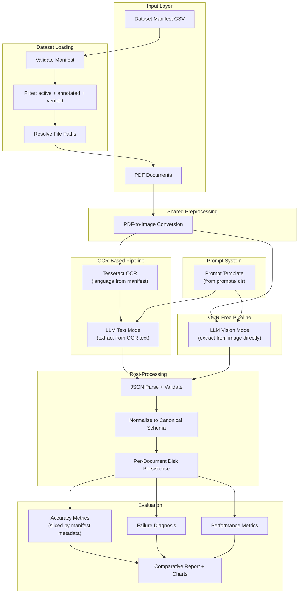

# SPEC --- OCR-Based vs OCR-Free Template-Free Extraction from Utility Bills

## 1. Problem Statement and Research Questions

### 1.1 Problem

Automated extraction of structured data from semi-structured documents is a core challenge in document intelligence. Utility bills (electricity, gas, water) are representative of this challenge: they exhibit high variability in layout, language, formatting, and information density across providers and countries. Two paradigms exist for extraction using Large Language Models:

- **OCR-based (text-mediated)**: PDF pages are rasterised, processed by an OCR engine to produce raw text, and that text is sent to an LLM in text mode for structured extraction.
- **OCR-free (vision-mediated)**: The same rasterised page images are sent directly to a Vision-Language Model in vision mode, bypassing OCR entirely.

The relative effectiveness of these paradigms is poorly understood, particularly in template-free, multilingual settings. Existing comparisons typically use different models or different prompts across pipelines, confounding input modality with model architecture and prompt design.

### 1.2 Research Questions

| # | Question |
|---|----------|
| **RQ1** | Does explicit OCR preprocessing improve or degrade extraction accuracy compared to direct visual extraction by the same LLM? |
| **RQ2** | How do the two pipelines compare in cost, latency, and operational complexity? |
| **RQ3** | Does the accuracy gap between OCR-based and OCR-free extraction vary across different LLM backends (model choice effect)? |

### 1.3 Framing Note

"OCR-free" in this project means VLM direct visual extraction using a general-purpose model's vision mode --- not a specialised document understanding model (e.g., Donut, Florence-2). The comparison is between **explicit OCR-mediated extraction** and **implicit visual extraction** using the same reasoning engine.

---

## 2. Experimental Design

### 2.1 Core Comparison (RQ1 + RQ2)

The LLM reasoning layer is held **constant** across both pipelines. The only variable is the input modality:

- **OCR-based**: `PDF -> image -> Tesseract OCR (language from manifest) -> raw text -> LLM (text mode) -> structured JSON -> normalise -> canonical schema`
- **OCR-free**: `PDF -> image -> LLM (vision mode) -> structured JSON -> normalise -> canonical schema`

This isolates the research question: does explicit OCR preprocessing help or hurt extraction accuracy compared to direct visual extraction by the same model?

### 2.2 2x2 Factorial Design (RQ3)

The paired comparison (text mode vs vision mode) is run with two different LLM backends:

|              | Text Mode (OCR-based) | Vision Mode (OCR-free) |
|--------------|-----------------------|------------------------|
| **Model A**  | Condition 1           | Condition 2            |
| **Model B**  | Condition 3           | Condition 4            |

Sub-questions addressed:
- Does one model consistently outperform the other regardless of mode?
- Does the OCR-vs-vision accuracy gap widen or narrow depending on the model?
- Cost-efficiency comparison across all four conditions.

### 2.3 Baseline Decisions

| Parameter | Decision | Rationale |
|-----------|----------|-----------|
| Model A | OpenAI GPT-4o | State-of-the-art general-purpose model with vision and structured output support |
| Model B | Anthropic Claude Sonnet | Leading alternative architecture from a different provider |
| Vision input | First 2 pages per document | Most target fields appear in the first two pages; limits cost and latency |
| Temperature | 0.0 | Maximises reproducibility |
| Prompt | Zero-shot, single version (`extraction_v1.txt`) | Avoids prompt variation as a confound |
| OCR engine | Tesseract v4+ (LSTM) | Open-source, local execution (no API cost confound), multilingual support |

### 2.4 Language Asymmetry

The OCR-based pipeline depends on per-document language configuration (Tesseract requires a language pack). The VLM vision mode handles multilingual input natively. This asymmetry is a design consideration relevant to RQ2 (operational complexity).

---

## 3. System Architecture

### 3.1 Architecture Diagram


```mermaid
flowchart TD
    subgraph input [Input Layer]
        Manifest[Dataset Manifest CSV]
        PDF[PDF Documents]
    end

    subgraph loader [Dataset Loading]
        Validate[Validate Manifest]
        Filter["Filter: active + annotated + verified"]
        Resolve[Resolve File Paths]
    end

    subgraph shared [Shared Preprocessing]
        Convert[PDF-to-Image Conversion]
    end

    subgraph ocrBased [OCR-Based Pipeline]
        OCR["Tesseract OCR\n(language from manifest)"]
        TextLLM["LLM Text Mode\n(extract from OCR text)"]
    end

    subgraph ocrFree [OCR-Free Pipeline]
        VisionLLM["LLM Vision Mode\n(extract from image directly)"]
    end

    subgraph prompt [Prompt System]
        PromptFile["Prompt Template\n(from prompts/ dir)"]
    end

    subgraph postProcess [Post-Processing]
        Parse[JSON Parse + Validate]
        Normalize[Normalise to Canonical Schema]
        Persist["Per-Document Disk Persistence"]
    end

    subgraph evalBlock [Evaluation]
        Metrics["Accuracy Metrics\n(sliced by manifest metadata)"]
        Diagnosis[Failure Diagnosis]
        Perf[Performance Metrics]
        Report[Comparative Report + Charts]
    end

    Manifest --> Validate --> Filter --> Resolve
    Resolve --> PDF --> Convert
    Convert --> OCR --> TextLLM --> Parse
    Convert --> VisionLLM --> Parse
    PromptFile --> TextLLM
    PromptFile --> VisionLLM
    Parse --> Normalize --> Persist --> Metrics
    Persist --> Diagnosis
    Persist --> Perf
    Metrics --> Report
    Diagnosis --> Report
    Perf --> Report
```

### 3.2 Design Principles

| Principle | Implementation |
|-----------|----------------|
| **Strategy pattern** for swappable components | `LLMProvider` ABC + registry; `OCREngine` ABC |
| **Abstract base classes** define contracts | Concrete implementations registered in provider registry |
| **Manifest-driven processing** | Dataset manifest CSV is the single source of truth for document metadata, filtering, and file resolution |
| **Prompt-as-config** | Extraction prompts are versioned files in `prompts/`, selected via config, not hardcoded |
| **Per-document persistence** | Results written to disk immediately after processing, enabling crash recovery and run resumption |
| **Schema-as-contract** | Single `BillExtraction` Pydantic model shared by prompt, LLM output, ground truth, normalisation, evaluation, and reporting |
| **Config-driven execution** | All settings via YAML; no hardcoded model names, API keys, or paths |
| **Disk-mediated decoupling** | Evaluation reads artefacts from disk, not in-memory objects; pipeline and evaluation are independently runnable |

---

## 4. Project Structure

```
project_root/
├── config/
│   ├── default.yaml              # Default pipeline configuration
│   └── experiments/              # Per-experiment YAML overrides
├── prompts/
│   └── extraction_v1.txt         # LLM prompt template with {schema_description}
├── src/
│   ├── __init__.py
│   ├── schema.py                 # BillExtraction, PipelineResult, DocumentEntry
│   ├── pipeline.py               # Batch orchestrator: run_pipeline(), _process_document()
│   ├── dataset_loader.py         # DatasetLoader: validate, filter, resolve manifest
│   ├── normalisation.py          # Shared normalisers for predictions and ground truth
│   ├── performance.py            # Timer, estimate_cost(), get_system_snapshot()
│   ├── reporting.py              # Chart generation and text summary
│   ├── utils.py                  # Config loading, PDF conversion, file I/O
│   ├── env.py                    # .env file loading (python-dotenv)
│   ├── ocr/
│   │   ├── base.py               # OCREngine ABC
│   │   └── tesseract.py          # TesseractOCR adapter
│   ├── llm/
│   │   ├── __init__.py           # Public exports: LLMProvider, get_provider
│   │   ├── base.py               # LLMProvider ABC
│   │   ├── openai_provider.py    # OpenAI Responses API + Structured Outputs
│   │   ├── anthropic_provider.py # Anthropic Messages API + fence stripping
│   │   └── registry.py           # Provider registry with lazy import
│   └── evaluation/
│       ├── __init__.py           # Public exports
│       ├── metrics.py            # compare_field, evaluate_document, evaluate_run
│       ├── diagnosis.py          # Failure attribution: OCR vs LLM vs vision
│       └── comparator.py         # Cross-run comparison: accuracy/perf matrices
├── data/
│   ├── dataset_manifest.csv      # Document registry (single source of truth)
│   ├── bills/                    # PDF files ({document_id}.pdf)
│   └── ground_truth/             # Annotation files ({document_id}.json)
├── results/
│   ├── runs/                     # Per-run output directories
│   └── reports/                  # Comparative analysis outputs
├── scripts/
│   ├── test_llm_e2e.py           # Manual E2E smoke test (4 conditions)
│   └── verify_session2.py        # Offline + optional online verification
├── cli.py                        # Click-based CLI entry point
├── requirements.txt              # Python dependencies with version constraints
├── SPEC.md                       # This file
├── README.md                     # Setup and usage guide
└── tests/
    ├── test_schema.py            # Schema model tests (35 tests)
    ├── test_normalisation.py     # Normalisation tests (82 tests)
    ├── test_dataset_loader.py    # Manifest validation tests (38 tests)
    ├── test_evaluation.py        # Metrics + diagnosis + comparator tests (82 tests)
    ├── test_pipeline.py          # Pipeline orchestration tests
    ├── test_llm.py               # LLM provider + registry tests
    ├── test_cli.py               # CLI command tests
    ├── test_ocr.py               # OCR engine tests
    ├── test_utils.py             # Utility function tests
    ├── test_reporting.py         # Report generation tests
    ├── test_performance.py       # Timer and cost estimation tests
    └── test_env.py               # Environment loading tests
```

---

## 5. Canonical Output Schema

### 5.1 BillExtraction (12 Fields)

All fields are `Optional` (nullable). Bills may legitimately omit fields. The LLM is instructed to return `null` for absent fields.

| Field | Type | Notes |
|-------|------|-------|
| `provider_name` | `string \| null` | Utility company name; legal suffixes stripped in normalisation |
| `utility_type` | `string \| null` | `electricity` / `gas` / `water` |
| `bill_number` | `string \| null` | Invoice/bill reference number |
| `bill_date` | `date \| null` | `YYYY-MM-DD` |
| `billing_period_start` | `date \| null` | `YYYY-MM-DD` |
| `billing_period_end` | `date \| null` | `YYYY-MM-DD` |
| `due_date` | `date \| null` | `YYYY-MM-DD` |
| `total_amount_due` | `float \| null` | Total amount to pay |
| `currency` | `string \| null` | ISO 4217 (GBP, EUR, etc.) |
| `account_number` | `string \| null` | Customer account reference |
| `consumption_amount` | `float \| null` | Usage quantity |
| `consumption_unit` | `string \| null` | kWh, m3, litres, SMC, etc. |

### 5.2 Schema Implementation

`BillExtraction` is implemented as a Pydantic `BaseModel` in `src/schema.py`. Key features:

- `SCHEMA_FIELDS` class variable: canonical ordered list of field names, used by evaluation, normalisation, and reporting to iterate fields consistently.
- `schema_description()` classmethod: generates a human-readable field description injected into the LLM prompt via the `{schema_description}` template placeholder.
- `model_config` with `json_schema_extra`: title set to `"Utility Bill Extraction"` for OpenAI Structured Outputs compatibility.
- Pydantic `date` type for date fields: handles ISO 8601 serialisation automatically.

### 5.3 PipelineResult

Container returned by the pipeline for each processed document:

| Field | Type | Purpose |
|-------|------|---------|
| `document_id` | `str` | Document identifier from manifest |
| `extraction` | `BillExtraction` | The 12-field extraction result |
| `raw_llm_output` | `str` | Verbatim LLM response (for debugging and diagnosis) |
| `ocr_text` | `str \| None` | Tesseract output (None in vision mode) |
| `timings` | `dict` | Per-stage timing breakdown (ms) |
| `token_usage` | `dict` | Input and output token counts from API response |
| `model_id` | `str` | e.g., `"openai/gpt-4o"` |
| `pipeline_mode` | `str` | `"ocr_text"` or `"vision"` |

### 5.4 DocumentEntry

Resolved row from `dataset_manifest.csv` (Python `dataclass`):

| Field | Type | Purpose |
|-------|------|---------|
| `document_id` | `str` | Unique key and filename stem |
| `language` | `str` | ISO 639-1; drives OCR language pack and evaluation slicing |
| `utility_type` | `str` | `electricity` / `gas` / `water` |
| `provider` | `str` | Billing company name |
| `digital_native` | `bool` | Born-digital vs scanned |
| `page_count` | `int` | Number of pages |
| `pdf_path` | `Path` | Resolved path to PDF file |
| `ground_truth_path` | `Path` | Resolved path to ground truth JSON |

---

## 6. Dataset Manifest

### 6.1 Manifest Structure

Single source of truth: `data/dataset_manifest.csv`.

| Column | Type | Purpose |
|--------|------|---------|
| `document_id` | string | Unique key; doubles as filename stem for PDF and ground truth |
| `language` | string | ISO 639-1 (`en`, `de`, `fr`, `it`); drives OCR language pack and evaluation slicing |
| `utility_type` | string | `electricity` / `gas` / `water` |
| `provider` | string | Billing company name |
| `digital_native` | boolean | Born-digital vs scanned |
| `page_count` | integer | Number of pages |
| `annotated` | boolean | Ground truth JSON has been created |
| `verified` | boolean | Ground truth has been manually verified |
| `status` | string | `active` / `excluded` |

### 6.2 Runnable Set

A document is eligible for experimental runs if and only if:

```
status = active AND annotated = true AND verified = true
```

This three-flag gating, enforced by `DatasetLoader.load_and_validate()`, ensures that only quality-controlled documents enter experimental runs.

### 6.3 File Resolution

- PDF: `data/bills/{document_id}.pdf`
- Ground truth: `data/ground_truth/{document_id}.json`

The `DatasetLoader` verifies file existence for all runnable documents at load time, failing early with descriptive error messages listing all missing files.

### 6.4 Validation Pipeline

`DatasetLoader.load_and_validate()` performs six sequential validation steps:

1. **File existence**: Manifest CSV must exist
2. **CSV parsing**: Must contain at least one data row
3. **Column validation**: All 9 required columns present
4. **Duplicate ID detection**: Reports exact row numbers of duplicates
5. **Value validation**: Language, utility_type, status against allowed sets; page_count must be integer. Errors are aggregated and reported together
6. **File existence verification**: Both PDF and ground truth files must exist for all runnable documents

---

## 7. Ground Truth Format

```json
{
  "document_id": "gb_electricity_ovo_001",
  "annotated_by": "student",
  "annotation_date": "2026-03-30",
  "fields": {
    "provider_name": "OVO Energy",
    "utility_type": "electricity",
    "bill_number": null,
    "bill_date": "2026-03-10",
    "billing_period_start": "2025-12-18",
    "billing_period_end": "2026-01-17",
    "due_date": null,
    "total_amount_due": 177.53,
    "currency": "GBP",
    "account_number": "26447122",
    "consumption_amount": 572.502,
    "consumption_unit": "kWh"
  }
}
```

Design rules:
- Fields not present on the bill are set to `null` explicitly (distinguishing "absent" from "unannotated").
- Provider names use canonical form without legal-form suffixes.
- Dates use ISO 8601 (`YYYY-MM-DD`).
- Currency uses ISO 4217 codes.
- Consumption units use canonical abbreviations (kWh, m3, SMC, L, etc.).

---

## 8. Module Interfaces

### 8.1 LLM Provider Interface

```python
class LLMProvider(ABC):
    def __init__(self, model, temperature=0.0, max_tokens=2000,
                 timeout=120.0, max_retries=2, **kwargs): ...

    @abstractmethod
    def extract_from_text(self, ocr_text: str, prompt: str) -> dict: ...

    @abstractmethod
    def extract_from_image(self, images: list[Image.Image], prompt: str) -> dict: ...

    @abstractmethod
    def get_model_id(self) -> str: ...

    @staticmethod
    def encode_image_base64(image: Image.Image, fmt: str = "PNG") -> str: ...
```

Both extraction methods return:
```python
{"raw_output": str, "token_usage": {"input_tokens": int, "output_tokens": int}, "latency_ms": float}
```

The `prompt` argument is the rendered instruction prompt (schema description + formatting rules). It does **not** contain the raw data. OCR text and images are passed as separate arguments and sent in the user message. This separation avoids duplicating input tokens and keeps the system/instruction message clean.

### 8.2 Provider-Specific API Choices

**OpenAI (`OpenAIProvider`)**: Uses the Responses API (`client.responses.parse`) with Structured Outputs (`text_format=BillExtraction`). Instructions go in the top-level `instructions` parameter; data goes in the `input` list. Vision images use `type: "input_image"` with a configurable `detail` parameter (`"high"` by default). Output length controlled via `max_output_tokens`. Structured Outputs guarantee schema-valid JSON via constrained decoding.

**Anthropic (`AnthropicProvider`)**: Uses the Messages API (`client.messages.create`) with prompt-instructed JSON output. Instructions go in the top-level `system` parameter; data goes in the `messages` list. Output length controlled via `max_tokens` (required by Anthropic API). Claude may wrap JSON in markdown code fences; `_strip_json_fencing()` removes these before downstream parsing.

### 8.3 Provider Registry

The `registry.py` module maps config strings to provider classes with lazy import:

```python
_PROVIDERS = {
    "openai": "src.llm.openai_provider.OpenAIProvider",
    "anthropic": "src.llm.anthropic_provider.AnthropicProvider",
}
```

`get_provider(config)` reads `config["llm"]["provider"]`, lazily imports the class, and instantiates with `model`, `temperature`, `max_tokens`, `vision_detail`, `timeout`, `max_retries`. Adding a new provider requires only a new module and one registry entry.

### 8.4 OCR Engine Interface

```python
class OCREngine(ABC):
    @abstractmethod
    def extract_text(self, image: Image.Image, language: str = "eng") -> str: ...
```

`TesseractOCR` implements this interface with a `LANGUAGE_MAP` mapping ISO 639-1 codes (`en`, `de`, `fr`, `it`) to Tesseract language codes (`eng`, `deu`, `fra`, `ita`). Tesseract errors are caught and return empty strings.

### 8.5 DatasetLoader

```python
class DatasetLoader:
    def __init__(self, manifest_path, bills_dir, ground_truth_dir): ...
    def load_and_validate(self) -> list[DocumentEntry]: ...  # Filtered + verified
    def load_all(self) -> list[DocumentEntry]: ...            # All rows, no file checks
```

`load_and_validate()` runs the full 6-step validation pipeline and returns only runnable documents. `load_all()` returns all documents (useful for manifest inspection) with column and duplicate validation but no file existence checks.

---

## 9. Normalisation

### 9.1 Normalisation Rules

Applied identically to predictions and ground truth before comparison, ensuring that formatting differences do not count as extraction errors.

| Field Type | Normalisation |
|------------|---------------|
| **Dates** | Parse against 10 format patterns (`YYYY-MM-DD`, `DD/MM/YYYY`, `DD.MM.YYYY`, etc.) into ISO 8601. Unparseable strings passed through |
| **Strings** | NFC Unicode normalisation, strip, lowercase, whitespace collapse |
| **Provider names** | String normalisation + iterative legal suffix stripping (Ltd, GmbH, SRL, S.p.A., s.c. a r.l., etc.) supporting multi-token suffixes |
| **Utility types** | Multilingual synonym mapping: `luce`/`strom`/`electricite` -> `electricity`; `acqua`/`wasser`/`eau` -> `water`; `gaz`/`erdgas`/`metano` -> `gas` |
| **Currencies** | Symbol and name mapping to ISO 4217 (`€` -> `EUR`, `£` -> `GBP`); valid 3-letter codes accepted; unknown -> `None` with warning |
| **Consumption units** | Synonym mapping: `kwh`/`kw/h`/`kilowatt hour` -> `kWh`; `m³`/`mc`/`cubic metre` -> `m3`; `smc`/`sm3` -> `SMC`; etc. |
| **Floats** | EU/US decimal parsing (heuristic based on separator positions); `bool` -> `None`; rounded to 2 decimal places |

### 9.2 Implementation

`FIELD_NORMALISERS` is a dispatch table mapping each of the 12 schema fields to its normaliser function. `normalise_extraction(fields)` applies the appropriate normaliser to every field, returning a dict with exactly 12 keys.

The float parser `_parse_numeric_string()` uses separator position heuristics:
- Both dot and comma present: dot before comma -> EU (`1.234,56`), comma before dot -> US (`1,234.56`)
- Comma only -> EU decimal separator (`1234,56`)
- No grouping separators -> standard `float()` parsing

---

## 10. Pipeline Orchestration

### 10.1 Run Execution Flow

`run_pipeline(config, force=False)` executes these steps:

1. **Resolve paths** from config (manifest, bills dir, ground truth dir, results dir, prompt file)
2. **Load and validate dataset** via `DatasetLoader.load_and_validate()`
3. **Instantiate LLM provider** via `get_provider(config)` (lazy SDK import)
4. **Instantiate OCR engine** (`TesseractOCR` if `mode == "ocr_text"`, else `None`)
5. **Create run directory** with unique ID: `{timestamp}_{provider}_{sanitised_model}_{mode}`
6. **Snapshot inputs** for reproducibility: config YAML, manifest CSV, prompt template
7. **Process each document** with resume logic and error isolation
8. **Write run summary** (total, processed, skipped, failed counts)

### 10.2 Per-Document Processing

`_process_document()` executes four timed stages:

| Stage | Description | Timing Key |
|-------|-------------|------------|
| 1 | PDF-to-image conversion (all pages) | `pdf_to_images_ms` |
| 2 | Prompt rendering (`{schema_description}` placeholder) | (negligible) |
| 3a | OCR: Tesseract on first 2 pages, concatenated text -> LLM text mode | `ocr_ms`, `llm_call_ms` |
| 3b | Vision: first 2 page images -> LLM vision mode | `llm_call_ms` |
| 4 | JSON parsing -> normalisation -> Pydantic validation | `parse_normalise_ms` |

### 10.3 JSON Parsing Hardening

`_parse_llm_json(raw)` handles common LLM output patterns:

1. **Direct parse**: `json.loads(text)` on stripped input
2. **Markdown fence strip**: Regex-matches ` ```json ... ``` ` blocks and parses the inner content
3. **Brace extraction**: Finds the first `{` and its matching `}` via brace-depth counting, parses the extracted substring
4. **Failure**: Raises `ValueError` with diagnostic excerpt (first 500 characters)

### 10.4 Resume Logic

If `extraction.json` already exists in a document's output directory, the document is skipped. The `--force` CLI flag overrides this, re-processing all documents.

### 10.5 Error Isolation

Each document is processed inside a `try/except`. On failure, an `error.json` (containing the error message and full traceback) is written to the document's output directory. The run continues with the remaining documents. The evaluation module skips documents with `error.json`.

---

## 11. Per-Run Output Structure

### 11.1 Run ID Format

`{timestamp}_{provider}_{sanitised_model}_{mode}`
Example: `20260401_120000_openai_gpt4o_vision`

### 11.2 Directory Layout

```
results/runs/{run_id}/
├── config.yaml                    # Frozen config (including CLI overrides)
├── manifest_snapshot.csv          # Manifest at run time
├── prompt.txt                     # Exact prompt template used
├── summary.json                   # Run statistics (total, processed, skipped, failed)
├── evaluation.json                # Written by evaluate command
└── documents/
    └── {document_id}/
        ├── extraction.json        # Normalised 12-field BillExtraction output
        ├── raw_llm_output.txt     # Verbatim LLM response
        ├── ocr_text.txt           # Tesseract output (OCR-text mode only)
        ├── timings.json           # Per-stage timing breakdown
        ├── metadata.json          # Document metadata + cost estimate
        ├── error.json             # Error details (only if document failed)
        └── diagnosis.json         # Failure attribution (only after diagnose)
```

---

## 12. Evaluation Methodology

### 12.1 Normalisation Before Comparison

Both predictions and ground truth are normalised identically via `normalise_extraction()` before any field-level comparison. This ensures that correct-but-differently-formatted extractions are not penalised (e.g., `"€"` vs `"EUR"`, `"01/03/2024"` vs `"2024-03-01"`).

### 12.2 Field-Level Comparison

Each field is compared using type-appropriate logic:

| Field Type | Comparison Strategy |
|------------|-------------------|
| **Float fields** (`total_amount_due`, `consumption_amount`) | Absolute tolerance +-0.01 (absorbs rounding differences after 2dp normalisation) |
| **Date fields** (`bill_date`, `billing_period_start`, `billing_period_end`, `due_date`) | Exact string match on normalised ISO 8601 strings |
| **String fields** (all others) | Exact match for `match` flag; Levenshtein similarity ratio (0.0--1.0) for partial credit |

### 12.3 Null Handling (4-Class Taxonomy)

| Ground Truth | Prediction | Classification | Metric Impact |
|--------------|------------|----------------|---------------|
| value | value | Normal compare | In denominator |
| null | value | **Hallucination** | Incorrect; in denominator |
| value | null | **Omission** | Incorrect; in denominator |
| null | null | **Both null** | Excluded from denominator |

`both_null` represents fields legitimately absent from both the bill and the extraction. They are counted as matching (`match=True`, `similarity=1.0`) but excluded from accuracy denominators to prevent inflation.

### 12.4 Accuracy Metrics

| Metric | Definition |
|--------|------------|
| **Field-level accuracy** | Per field: `correct / (correct + incorrect + hallucination + omission)` across all documents |
| **Document-level accuracy** | Fraction of documents with zero incorrect, zero hallucination, and zero omission fields |
| **Overall accuracy** | All fields across all documents: total correct / total evaluated |
| **Slice accuracy** | Accuracy computed for document subsets grouped by language or utility type |

### 12.5 Failure Diagnosis

For each incorrect field:

**OCR-text mode**:
- Search stored `ocr_text.txt` for the ground truth value (case-insensitive substring match)
- Value found -> **LLM extraction failure** (Tesseract captured the value but the LLM missed it)
- Value not found -> **OCR failure** (Tesseract failed to capture the value)

**Vision mode**:
- All incorrect fields -> **vision model failure** (no intermediate artefact for finer attribution)

### 12.6 Provider-Name Canonicalisation

Bills often include legal suffixes (e.g., `"Acque Veronesi s.c. a r.l."`). Both ground truth and predictions are normalised by stripping common legal-form suffixes (Ltd, GmbH, SRL, S.p.A., s.c. a r.l., etc.) so that legal-form formatting does not count as a semantic extraction error.

---

## 13. Cross-Run Comparison

`compare_runs()` loads or computes evaluation data for multiple runs and builds:

| Output | Content |
|--------|---------|
| **Accuracy matrix** | Per-run overall accuracy, document-level accuracy, and 12 per-field accuracies |
| **Performance matrix** | Per-run mean total time, mean LLM call time, mean OCR time, total estimated cost |
| **Null analysis** | Per-run hallucination, omission, and both_null counts |
| **Slice comparisons** | Accuracy by language and utility type for each run |

Writes `comparison.json` to the reports directory.

---

## 14. Reporting

`generate_report()` reads `comparison.json` and produces:

### 14.1 Charts (6 PNG figures)

| Chart | Description | Research Question |
|-------|-------------|-------------------|
| `overall_accuracy.png` | Bar chart: one bar per condition | RQ1 (modality comparison) |
| `field_accuracy_heatmap.png` | Heatmap: 12 fields x 4 conditions | RQ1 (field-level analysis) |
| `timing_breakdown.png` | Stacked bar: OCR time + LLM time | RQ2 (latency) |
| `cost_comparison.png` | Bar chart: total cost per condition | RQ2 (cost) |
| `accuracy_by_language.png` | Grouped bar: accuracy by language | RQ1/RQ3 (language effect) |
| `accuracy_by_utility_type.png` | Grouped bar: accuracy by utility type | RQ1 (utility type effect) |

### 14.2 Text Summary (`summary.txt`)

- Results overview table (accuracy, document-level accuracy, LLM latency, cost per condition)
- Best and worst conditions
- Easiest and hardest fields
- Null analysis (hallucination and omission counts per condition)
- Accuracy by language table
- Accuracy by utility type table
- Full field-level accuracy table

---

## 15. Performance Measurement (RQ2)

| Metric | OCR-based | Vision | Measurement |
|--------|-----------|--------|-------------|
| Total wall-clock time | Yes | Yes | `Timer` context manager (`time.perf_counter()`) |
| PDF-to-image time | Yes | Yes | Timer on conversion step |
| OCR time (Tesseract) | Yes | N/A | Timer on OCR step |
| LLM API latency | Yes | Yes | Timer on API call |
| Normalisation time | Yes | Yes | Timer on parse + normalisation step |
| Token usage (in/out) | Yes | Yes | From API response metadata |
| Estimated cost | Yes | Yes | Tokens x per-token pricing lookup |

`estimate_cost()` uses a pricing table for known models (per 1M tokens). Unknown models return $0.00 with a warning.

---

## 16. Configuration

### 16.1 Default Config (`config/default.yaml`)

```yaml
pipeline:
  mode: "ocr_text"                # "ocr_text" or "vision"

ocr:
  engine: "tesseract"             # Extensible: "easyocr", "paddleocr"

llm:
  provider: "openai"              # "openai" or "anthropic"
  model: "gpt-4o"                 # Provider-specific model name
  temperature: 0.0
  max_tokens: 2000
  structured_output: true
  prompt_file: "prompts/extraction_v1.txt"
  vision_detail: "high"           # OpenAI only: "low", "high", "auto"
  timeout: 120                    # HTTP timeout in seconds
  max_retries: 2                  # SDK-level automatic retries

data:
  manifest: "data/dataset_manifest.csv"
  bills_dir: "data/bills"
  ground_truth_dir: "data/ground_truth"

output:
  results_dir: "results/runs"
  save_intermediate: true
```

### 16.2 CLI Overrides

CLI flags are deep-merged into the YAML config, allowing quick iteration without editing config files:

```bash
python cli.py run --config config/default.yaml --mode vision --provider anthropic --model claude-sonnet-4-5-20250929
```

Supported overrides: `--manifest`, `--mode`, `--provider`, `--model`, `--force`.

---

## 17. CLI Interface

```bash
# Run extraction pipeline
python cli.py run --config config/default.yaml
python cli.py run --config config/default.yaml --mode vision --provider openai --model gpt-4o
python cli.py run --config config/default.yaml --force

# Evaluate a completed run
python cli.py evaluate --run-dir results/runs/{run_id}/
python cli.py evaluate --run-dir results/runs/{run_id}/ --diagnose

# Compare multiple runs (the 2x2 matrix)
python cli.py compare --runs results/runs/...text/ --runs results/runs/...vision/

# Generate charts and summary from comparison
python cli.py report --comparison results/reports/comparison.json --output results/reports/
```

---

## 18. Prompt System

### 18.1 Template Design

Prompts are stored as versioned files in `prompts/`. Selected via `llm.prompt_file` in config.

The template contains:
- Role instruction ("You are a utility bill data extraction assistant")
- Schema description (injected via `{schema_description}` placeholder from `BillExtraction.schema_description()`)
- Output format rules (JSON only, exactly 12 fields, null for missing, ISO dates, ISO 4217 currency, no hallucination)
- Provider name rules (strip legal suffixes)

### 18.2 Separation of Instructions and Data

The prompt contains **only** extraction instructions and the schema description. Raw data (OCR text or images) is provided separately in the user message to avoid duplicating input tokens. This separation keeps the system/instruction message clean and is consistent across both providers.

### 18.3 Prompt Archival

The exact prompt used for each run is copied to `results/runs/{run_id}/prompt.txt` for reproducibility.

---

## 19. Testing

### 19.1 Test Coverage

The project includes 237+ automated tests across 12 test files:

| Test File | Coverage | Tests |
|-----------|----------|-------|
| `test_schema.py` | BillExtraction defaults, serialisation, schema_description, PipelineResult, DocumentEntry | 35 |
| `test_normalisation.py` | All normalisers, date formats, EU/US floats, currency maps, unit synonyms, provider suffixes | 82 |
| `test_dataset_loader.py` | Manifest validation, filtering, path resolution, error aggregation, edge cases | 38 |
| `test_evaluation.py` | compare_field null table, float tolerance, Levenshtein, evaluate_document, evaluate_run, diagnosis, comparator | 82 |
| `test_pipeline.py` | JSON parsing (fences, brace extraction), run ID generation, mocked pipeline integration | varies |
| `test_llm.py` | Provider ABC, registry, mocked SDK calls, fence stripping | varies |
| Other test files | CLI commands, OCR engine, reporting, performance, utils, env loading | varies |

### 19.2 Testing Strategy

- **Unit tests**: Individual functions and methods tested in isolation (normalisers, field comparisons, JSON parsing)
- **Integration tests**: End-to-end flows with filesystem fixtures (DatasetLoader with temp CSV/files, evaluate_run with mock run directories)
- **Parametrised tests**: Extensive use of `@pytest.mark.parametrize` for date formats, currency mappings, unit synonyms, and normalisation edge cases
- **E2E smoke test**: Manual `scripts/test_llm_e2e.py` exercising all 4 conditions against a real document (requires API keys; costs money)

---

## 20. Dependencies

### 20.1 Python Packages

```
pydantic>=2.0          # Schema validation and structured output
pyyaml                 # YAML config parsing
pdf2image              # PDF-to-image conversion (requires Poppler)
Pillow                 # Image handling
pytesseract            # Tesseract OCR Python binding
openai                 # OpenAI API client
anthropic              # Anthropic API client
python-Levenshtein     # String similarity metrics
psutil                 # System resource monitoring (optional)
matplotlib             # Chart generation
seaborn                # Statistical chart styling
pandas                 # Data manipulation for reporting
click                  # CLI framework
pytest                 # Test framework
python-dotenv          # .env file loading
```

### 20.2 System Dependencies

- **Poppler**: Required by `pdf2image` for PDF rasterisation
- **Tesseract OCR**: Required by `pytesseract`; language packs: `eng`, `deu`, `fra`, `ita`

---

## 21. Risks and Mitigations

| Risk | Impact | Mitigation |
|------|--------|------------|
| Dataset < 20 bills | Weak statistical claims | Aim for 5+ per language; report limitations; frame as case study |
| API account setup delays | Blocks experiments | Set up accounts early; dev models available for testing |
| OCR text too noisy for LLM | Skewed results toward vision | Store OCR text for diagnosis; noisy OCR is a valid finding |
| Prompt sensitivity | Results vary with wording | Identical prompt for both modes; archived per run |
| API rate limits / outages | Delays experiments | SDK-level retries (configurable); resume mode skips completed docs |
| "Both use same model" criticism | Reviewer questions validity | Comparing input modalities, not models; controlled variable is a strength |
| Ground truth annotation errors | Corrupted evaluation | Self-validate via model disagreements; manifest tracks `verified` flag |
| Manifest out of sync with disk | Pipeline fails or silently skips | DatasetLoader validates file existence at load time |
| Multi-language Tesseract variance | Confounding variable | Per-language analysis via manifest slicing |
| Provider-name legal suffixes | Inflated string mismatch rate | Normalisation strips legal suffixes; canonicalised provider names |
| Structured output asymmetry | Confounds format reliability with extraction accuracy | Raw LLM output archived for post-hoc analysis |

---

## 22. Out of Scope

The following are explicitly excluded from the current implementation:

- Image preprocessing pipeline (grayscale, binarisation, deskew)
- Fine-tuning of any model
- Few-shot prompting (examples in prompt)
- REST API or web frontend
- Docker containerisation
- Specialised OCR-free models (Donut, Florence-2, Pix2Struct)
- Remote database integration
- Annotation tooling
- Asynchronous or parallel document processing
- Confidence scoring or calibration
- Inter-annotator agreement measurement

---

## 23. Budget Estimate

With 20--50 documents and 2x2 factorial:

| Component | Estimated Cost |
|-----------|---------------|
| Main experiments (4 conditions) | $5--15 |
| Development and debugging | $5--10 |
| Re-runs and iteration | $5--10 |
| **Total** | **$20--40** |
